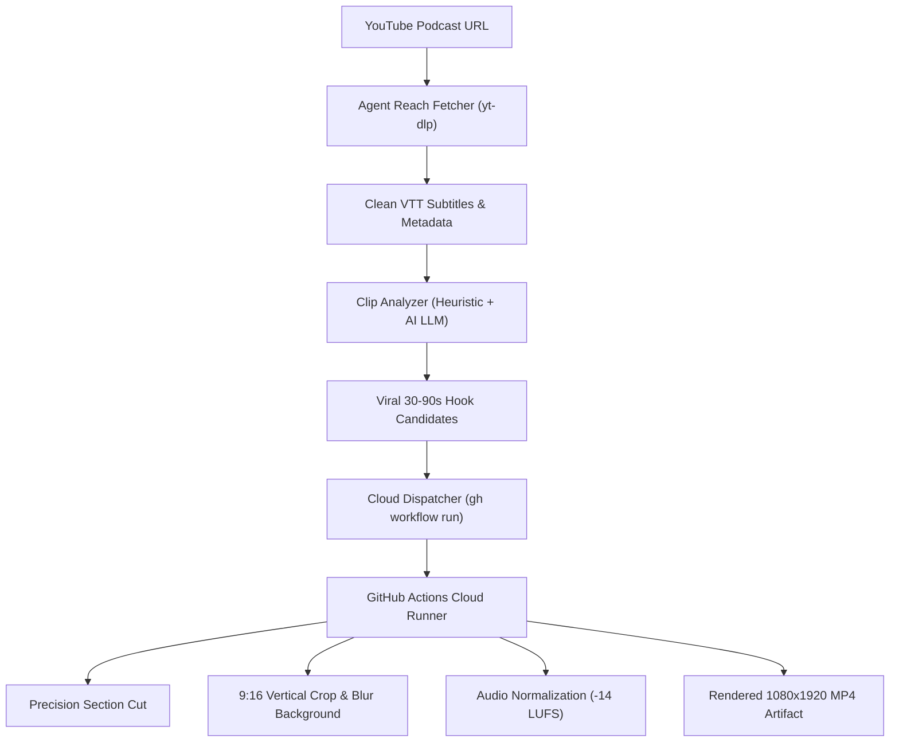

# 🎙️ YouTube Podcast Clipper (`youtube-podcast-clipper`)

Autonomous podcast clipping and viral Short generator leveraging the **Agent Reach** internet routing layer and cloud-offloaded GitHub Actions video rendering.

---

## ⚡ Architecture



## 🛠️ Key Capabilities

1. **Agent Reach Zero-Video Extraction**:
   - Fetches full podcast transcripts, chapter boundaries, and metadata in 2–3 seconds without downloading gigabytes of video.
   - Fully compliant with lightweight mobile constraints.
2. **Viral Hook Detection Engine**:
   - Identifies high-tension pattern interrupts in the first 3 seconds.
   - Filters continuous cohesive thought segments between 30 and 90 seconds.
   - Generates curiosity-gap Short titles and retention metrics.
3. **Cloud-Offloaded Video Rendering**:
   - Zero local FFmpeg or heavy encoding on device.
   - Automatically offloads `yt-dlp --download-sections` and FFmpeg 9:16 filtergraphs to remote GitHub Actions runners.

---

## 🚀 Quick Start

### 1. Extract & Score Viral Clips from a YouTube Podcast
```bash
python3 run_clipper.py "https://www.youtube.com/watch?v=VIDEO_ID" --top-k 3 --out clips.json
```

Or by YouTube search query:
```bash
python3 run_clipper.py "ytsearch1:lex fridman podcast DHH" --top-k 3 --out clips.json
```

### 2. Dispatch Cloud Render (GitHub Actions)
Trigger remote cloud rendering using the generated spec:
```bash
gh workflow run render_podcast_clips.yml \
  --repo loobah18-arch/youtube-podcast-clipper \
  -f video_url="https://www.youtube.com/watch?v=VIDEO_ID" \
  -f start_time="120.5" \
  -f end_time="175.2" \
  -f title="Why Most Programmers Are Wrong About AI"
```

---

## 🧪 Testing

```bash
python3 -m unittest tests/test_clipper.py
```
*Fast, isolated mocked tests finish in < 0.01 seconds.*
